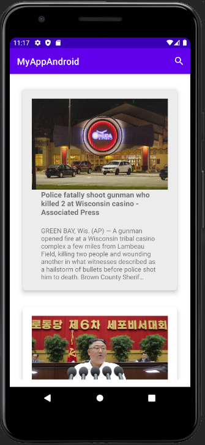
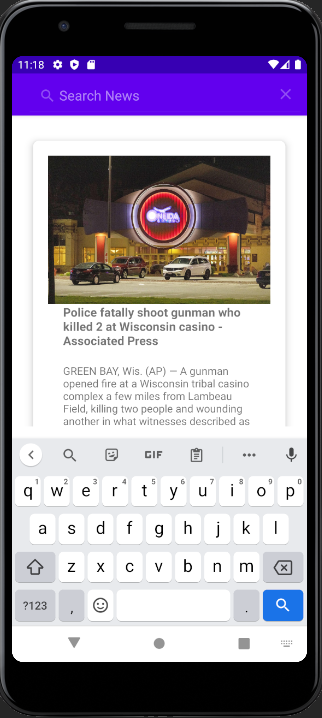
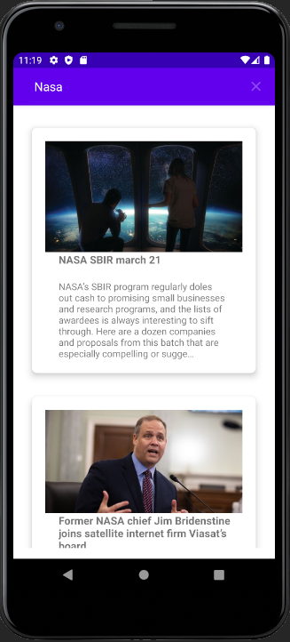
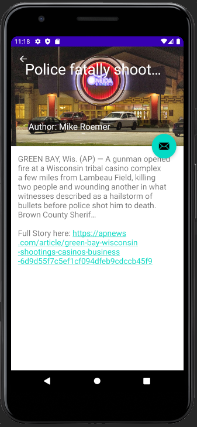
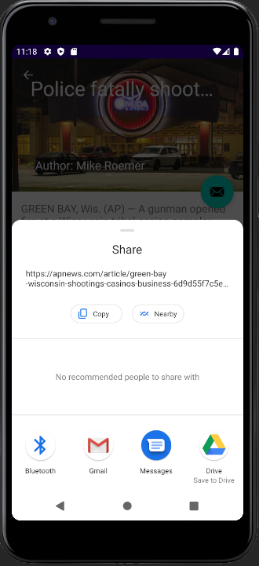

# MyAppAndroid
SJSU CMPE277 Android sample code, Spring 2021

# Homework 2 - News App using Retrofit with Moshi/Gson

### [Demo Link](https://drive.google.com/file/d/1i_QLig9-WYzysPKdn44uSQNDhAqj1gDz/view?usp=sharing)

### Features:
* Using newsapi for getting the news
* Using Glide to display the image in recyclerview and in detail view
* Network call using Retrofit with Moshi for displaying news in recyclerview
* Detail view dispalys image, title, author name in toolbar layout and description and url link to news source in scrolling view
* Added share intent to the floating button in detail view
* Network call using Retrofit with Gson for searching news

### Application UI screenshots
  
 
  
 

